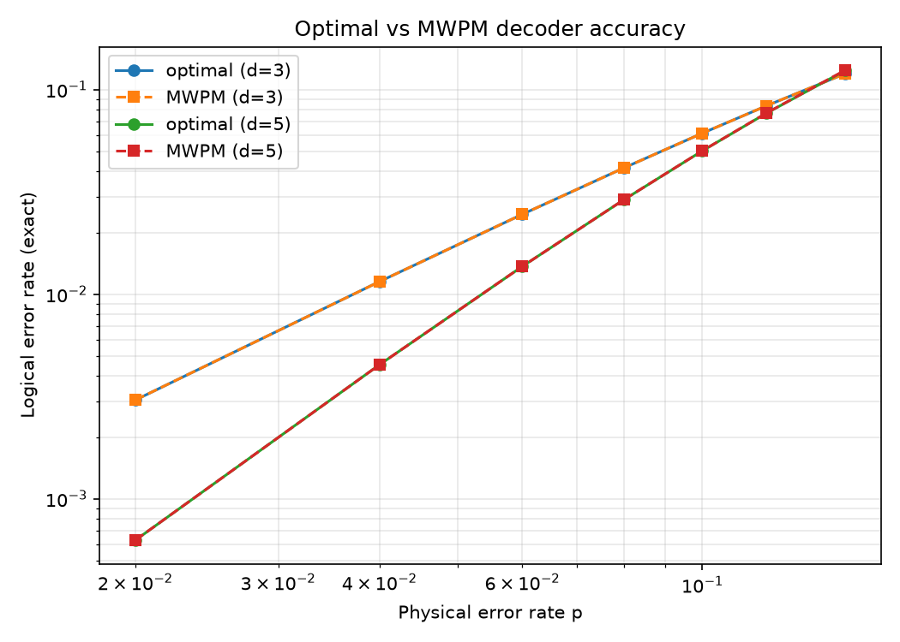
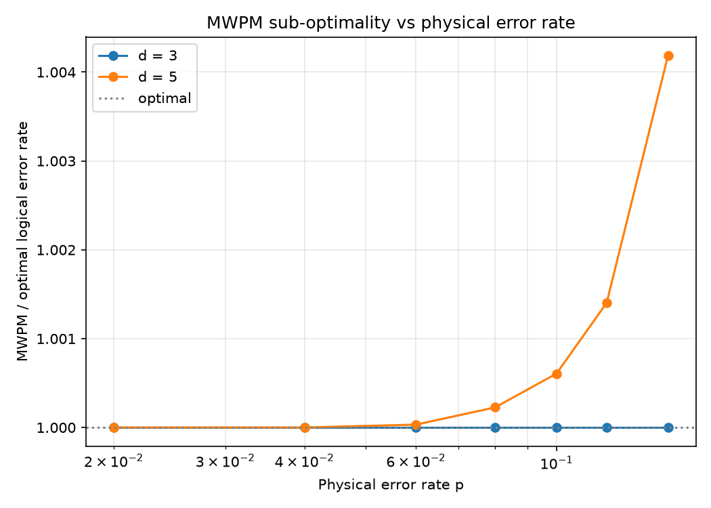

# Decoder Accuracy Reproduction

A reproduction of the methodology of *Testing the Accuracy of Surface Code Decoders*
(arXiv:2311.12503): quantifying how far a practical decoder (minimum-weight perfect matching) is
from the **optimal** maximum-likelihood decoder, which sets a hard lower bound on the logical error
rate.

This is repo 7 (capstone B) of a seven-part [QEC research portfolio](https://github.com/afogelis/qec-portfolio). It builds on
[`surface-code-simulator`](https://github.com/afogelis/surface-code-simulator) and
[`decoder-benchmark`](https://github.com/afogelis/decoder-benchmark), and directly validates the
MWPM decoder benchmarked there.

## The idea

In the code-capacity model (one round, data-qubit noise, perfect measurements) a small surface code
has few enough independent error mechanisms that **every error pattern can be enumerated**. That
makes the logical error rate of any decoder *exactly* computable:

- the **optimal decoder** chooses, per syndrome, the most probable logical class -> a lower bound;
- **MWPM** chooses a fixed class per syndrome, evaluated against the same exact enumeration.

The ratio MWPM / optimal is the decoder's sub-optimality. It is provably >= 1 and grows with the
physical error rate.

## What this demonstrates

- Implementing an **exact maximum-likelihood decoder** by error-coset enumeration.
- Exact (sampling-free) logical error rates, and a rigorous decoder-quality metric.
- Reproducing a recent methods paper and connecting it to the rest of the portfolio's decoders.

## Install and run

```bash
pip install -e ".[dev]"
pytest
darepro --distances 3 --p 0.02,0.04,0.06,0.08,0.10,0.12,0.15
```

For local development with checked-out sibling repos:

```bash
pip install -e ../surface-code-simulator
pip install -e ../decoder-benchmark --no-deps
pip install -e . --no-deps
```

## Results



*Exact logical error rate of the optimal decoder and of MWPM. At low p the curves coincide; MWPM is optimal there.*



*Sub-optimality ratio (MWPM/optimal >= 1). MWPM is optimal at d=3 and develops a small, growing gap at d=5.*

Full write-up: [`reports/TECHNICAL_REPORT.md`](reports/TECHNICAL_REPORT.md) — results table, sub-optimality, caveats, references.

## Limitations

Exact enumeration restricts the analysis to small distances. The paper builds exhaustive look-up
tables for surface codes up to distance seven (comparing both MWPM and belief propagation against
them); the qualitative conclusion -- a small, growing matching sub-optimality -- is reproduced here
exactly on small code-capacity instances.

## References

- Maan AS, Paler A. Testing the Accuracy of Surface Code Decoders. arXiv:2311.12503, 2023.
- Dennis E, Kitaev A, Landahl A, Preskill J. Topological quantum memory. Journal of Mathematical Physics 2002; 43:4452-4505.

## License

MIT — see [LICENSE](LICENSE).
